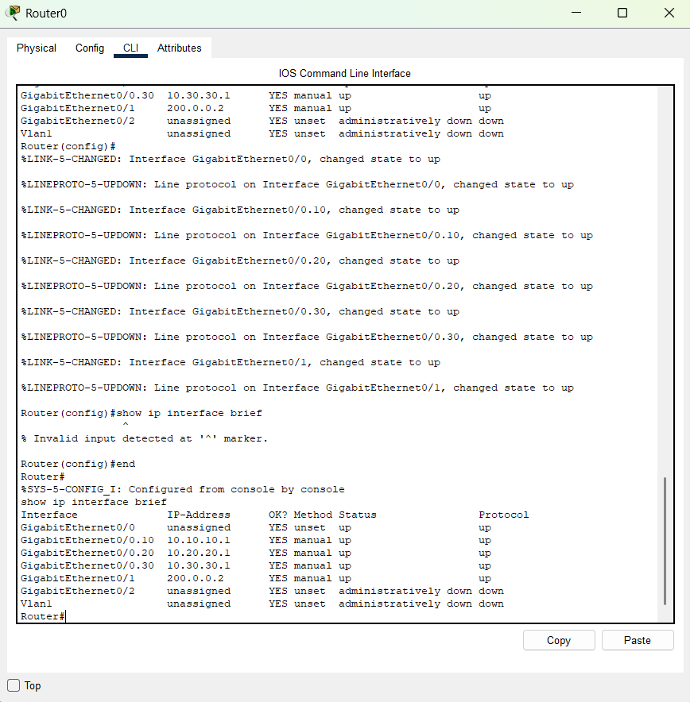

<div align="center">

# 🌐 Topologia de Redes Corporativa — Cisco Packet Tracer

**Projeto de infraestrutura de rede com VLANs, roteamento inter-VLAN e segmentação departamental.**

[](https://www.cisco.com/)
[](https://github.com/Lfn22/topologiaderedes)

</div>

---

## 📋 Sobre o projeto

Projeto de infraestrutura de rede corporativa simulada no **Cisco Packet Tracer**. Implementa segmentação de rede por departamentos usando VLANs, com roteamento inter-VLAN e isolamento de tráfego entre setores da empresa.

---

## 🏢 Arquitetura da rede

A topologia simula uma empresa com dois departamentos isolados em VLANs separadas:

| VLAN | Departamento | Propósito |
|---|---|---|
| VLAN 10 | Financeiro | Isolamento de dados financeiros sensíveis |
| VLAN 20 | Suporte | Tráfego de suporte técnico interno |

---

## ✨ Funcionalidades implementadas

- 🔀 **Segmentação por VLANs** — isolamento de tráfego departamental
- 🔄 **Roteamento inter-VLAN** — comunicação controlada entre setores
- 🔌 **Configuração de switch** — trunk e access ports
- 🛡️ **Isolamento de segurança** — cada departamento em domínio broadcast separado
- 📡 **Configuração de roteador** — subinterfaces para cada VLAN

---

## 🖼️ Diagramas da topologia

### Visão geral da rede


### VLAN Financeiro


### VLAN Suporte


---

## 🚀 Como abrir o projeto

### Pré-requisitos
- [Cisco Packet Tracer](https://www.netacad.com/courses/packet-tracer) instalado (gratuito via NetAcad)

### Passos

```
1. Faça o download ou clone este repositório
2. Abra o Cisco Packet Tracer
3. Vá em File > Open
4. Selecione o arquivo "MAIS UMA TENTATIVA.pkt"
5. Explore a topologia e as configurações de cada dispositivo
```

---

## 🗂️ Estrutura do projeto

```
topologiaderedes/
├── MAIS UMA TENTATIVA.pkt   # Arquivo do Packet Tracer (topologia completa)
├── roteador.png             # Diagrama geral da rede
├── vlan financeiro.png      # Diagrama da VLAN Financeiro
└── vlan suporte.png         # Diagrama da VLAN Suporte
```

---

## 🛠️ Tecnologias e protocolos

| Tecnologia | Uso |
|---|---|
| Cisco Packet Tracer | Simulação de rede |
| VLANs (802.1Q) | Segmentação de rede |
| Roteamento inter-VLAN | Comunicação entre departamentos |
| Trunk / Access ports | Configuração de switch |
| Endereçamento IP | Subnetting por VLAN |

---

## 📚 Conceitos praticados

- Projeto e documentação de infraestrutura de redes
- Configuração de VLANs em switches Cisco
- Roteamento inter-VLAN com subinterfaces
- Segurança de rede por segmentação
- Documentação técnica com diagramas

---

## 👨‍💻 Autor

**Lindomar Negreiros** — Engenheiro de Software | Fundador da Negreiros Tech

[](https://www.linkedin.com/in/lindomar-lopes-de-negreiros-filho-4540b8220/)
[](https://github.com/Lfn22)

---

## 📄 Licença

Este projeto está sob a licença MIT.
